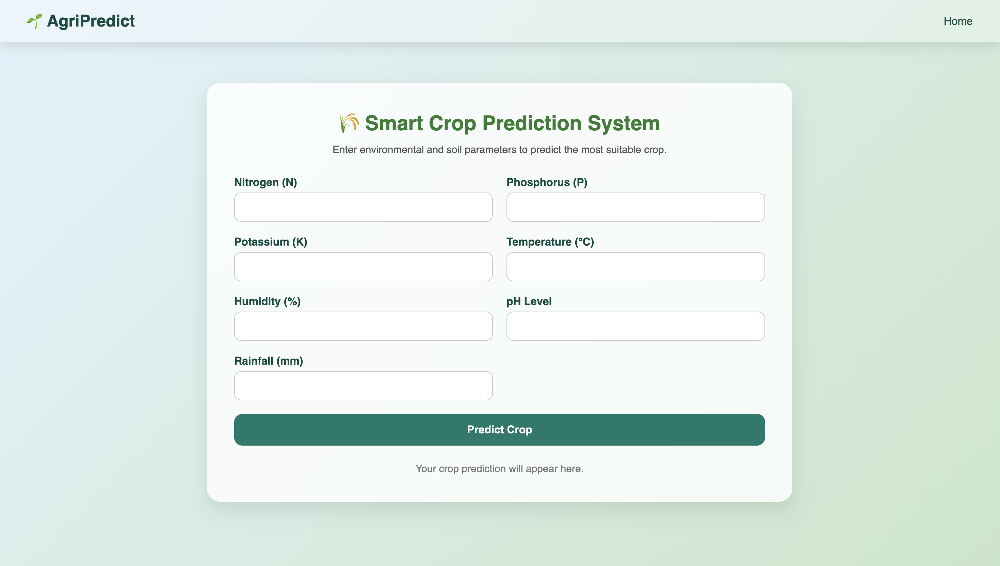
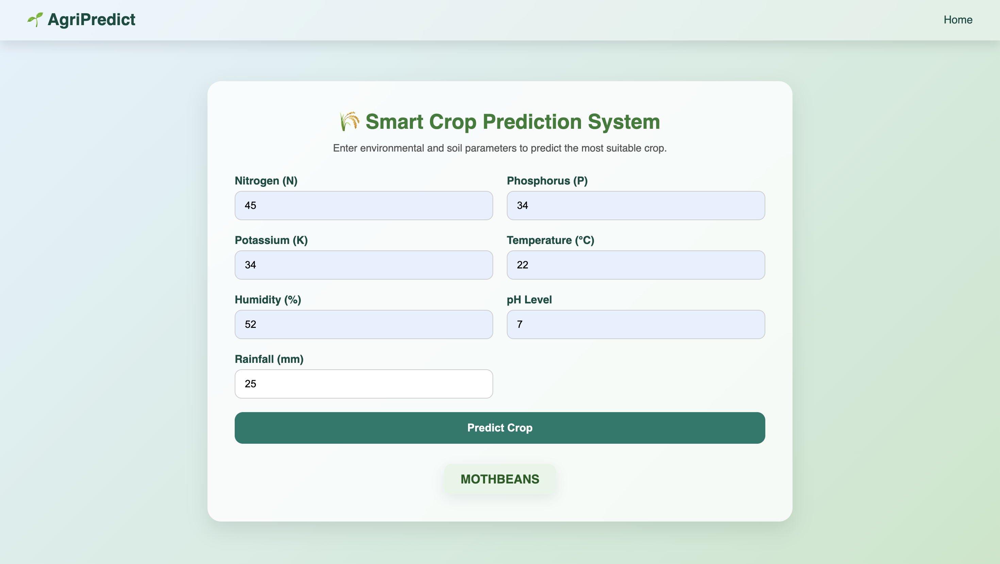

# 🌾 Crop Prediction Web Application

A smart and responsive crop prediction system that helps farmers and agricultural experts identify the most suitable crop to grow based on soil and environmental parameters.

---

## 🚀 Technologies Used

- **Frontend:**
  - HTML5
  - CSS3 (Responsive + Glassmorphism + Animations)
  - JavaScript (optional enhancements)

- **Backend:**
  - Python 3.x
  - Flask

- **Machine Learning:**
  - scikit-learn
  - NumPy
  - Pandas
  - Trained ML model (RandomForestClassifier / any)

---

## 📸 Project Screenshots

### 🖼️ Main UI Page

### 🖼️ Prediction Result

---

